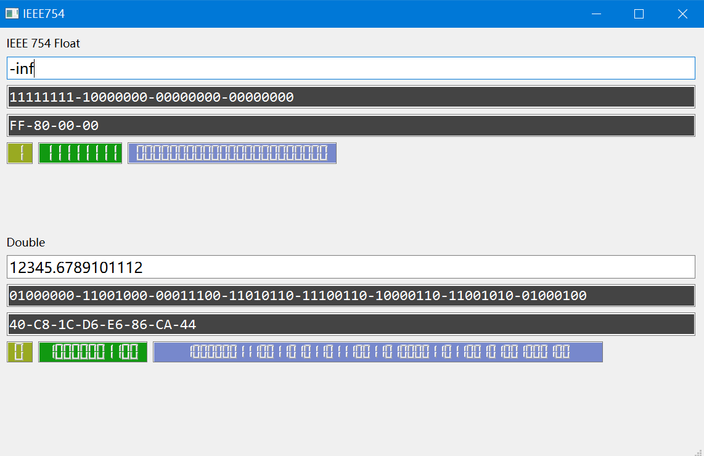

# IEEE754

How IEEE754 floating point numbers are stored？



> **WARNING**: This is a little learning experiment, the results of which depend on your Python C implementation.

Inspired by [Tools & Thoughts IEEE-754 Floating Point Converter](https://www.h-schmidt.net/FloatConverter/IEEE754.html) and built with `PySide6`.

## Floating point number

$$
V = (-1)^s \times 2^{e - B} \times (1 + m)
$$

where:
- $s$ is `sign`, 1 bit
- $e$ is `exponent`, 8 bit (`float`), or 11 bit (`double`)
- $m$ is `mantissa`, 23 bit (`float`) or 52 bit (`double`), is fixed-point number in $[0,\,1)$
- $B = 2^7 - 1 = 127$ when `float`
- $B = 2^{10} - 1 = 1023$ when `double`

Classification of floating point numbers (**for `float`**):
1. For normalized floating-point numbers, $e \neq 255$, $e \neq 0$
2. For denormalized floating-point numbers, $e = 0$
    - When $s = 0$ and $m = 0$, which means $+0.0$
    - When $s = 1$ and $m = 0$, which means $-0.0$
3. Infinity is expressed as $e = 255$, $m = 0$
    - For $s = 0$, $e = 255$, $m = 0$ means $+\infty$
    - For $s = 1$, $e = 255$, $m = 0$ means $-\infty$
4. Not a number (`NaN`) is expressed as $e = 255$, $m \neq 0$

## Usage

```bash
pip install -r requirements.txt
pyside6-uic float.ui -o ui_float.py
python main.py
```

## License

MIT.
